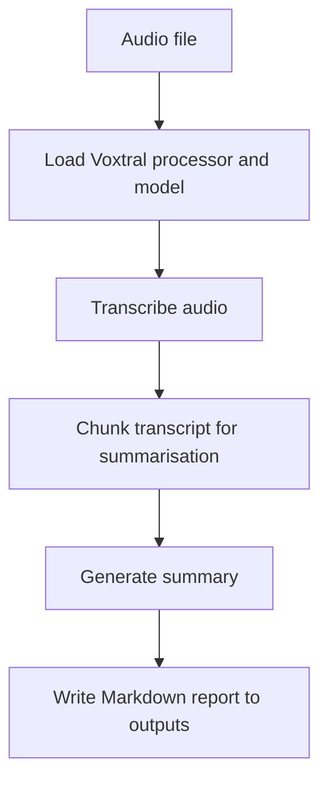
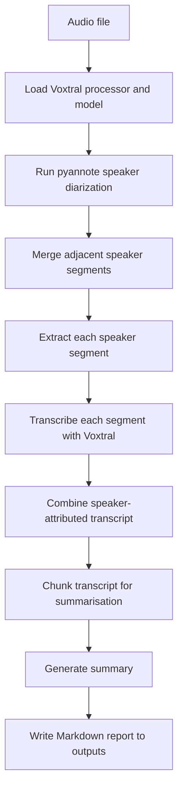
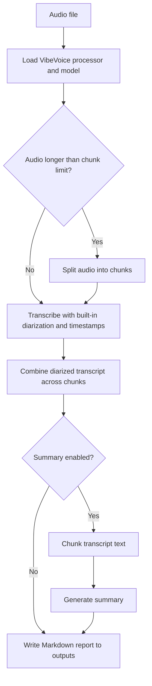

# Summarisation POC

This repository contains two local audio-to-text pipelines built on Hugging Face Transformers:

- `main.py` uses Voxtral for transcription and summarisation, with optional speaker diarization via `pyannote-audio`.
- `vibevoice.py` uses VibeVoice-ASR for transcription with built-in speaker diarization and optional summarisation.

Both scripts are intended to be run with `uv` and write a Markdown report into `outputs/` by default.

## What Each Script Does

### `main.py`

`main.py` is the Voxtral-based pipeline.

It can:

- transcribe an audio file locally with Transformers
- optionally run speaker diarization with `pyannote-audio`
- transcribe speaker segments individually when diarization is enabled
- summarise the resulting transcript in bounded text chunks
- write a Markdown report with the transcript and summary

Useful when you want:

- Voxtral transcription
- optional diarization with explicit speaker separation
- CPU fallbacks for transcription or summarisation to avoid MPS memory issues

#### Pipeline without diarization



#### Pipeline with diarization



### `vibevoice.py`

`vibevoice.py` is the VibeVoice-ASR pipeline.

It can:

- transcribe an audio file locally with Transformers
- use VibeVoice's built-in speaker diarization and timestamps
- split long audio files into chunks before transcription
- summarise the transcript with the same model's text generation path
- write a Markdown report with diarized transcript, raw transcript when needed, and summary

Useful when you want:

- built-in diarization without `pyannote`
- timestamped speaker-attributed transcript output
- a single-script flow for transcription, diarization, and summarisation

#### Pipeline



## Setup

### 1. Clone the repository

This repo stores `.wav` files in Git LFS, so install Git LFS before cloning.

On macOS with Homebrew:

If you don't have git LFS installed:

```bash
brew install git-lfs
git lfs install
```

Then

```bash
git clone git@github.com:icelattefull/call-summarisation-poc.git
cd call-summarisation-poc
git lfs pull
```

### 2. Install `uv`

If `uv` is not installed already:

```bash
curl -LsSf https://astral.sh/uv/install.sh | sh
```

### 3. Install Python dependencies

From the repository root:

```bash
uv sync
```

This installs the dependencies declared in `pyproject.toml`.

### 4. Optional system dependency: `ffmpeg`

Some audio formats and chunking fallbacks work better when `ffmpeg` is available.

On macOS with Homebrew:

```bash
brew install ffmpeg
```

### 5. Hugging Face access

Some workflows require Hugging Face access:

- `main.py --diarize` requires a Hugging Face token and accepted terms for `pyannote/speaker-diarization-3.1`
- model downloads may require you to be logged in depending on your local Hugging Face setup

Set your token before running diarization:

```bash
export HF_TOKEN=your_token_here
```

You must also accept the model terms at:

- https://huggingface.co/pyannote/speaker-diarization-3.1
- https://huggingface.co/pyannote/speaker-diarization-community-1

## Usage With `uv`

### Run `vibevoice.py`

Basic example:

```bash
uv run vibevoice.py ./assets/test_1.wav
```

With a prompt to bias transcription toward known context or proper nouns:

```bash
uv run vibevoice.py ./assets/test_1.wav --prompt "Meeting about Project Alpha"
```

Write to a specific output file:

```bash
uv run vibevoice.py ./assets/test_1.wav -o ./outputs/test_1_vibevoice.md
```

Skip summarisation:

```bash
uv run vibevoice.py ./assets/test_1.wav --no-summary
```

### Run `main.py`

Basic example:

```bash
uv run main.py ./assets/test_1.wav
```

With diarization enabled:

```bash
uv run main.py ./assets/test_1.wav --diarize
```

With a language hint:

```bash
uv run main.py ./assets/test_1.wav --language en
```

Force transcription or summarisation onto CPU to reduce MPS pressure:

```bash
uv run main.py ./assets/test_1.wav --transcribe-on-cpu --summary-on-cpu
```

Write to a specific output file:

```bash
uv run main.py ./assets/test_1.wav -o ./outputs/test_1_voxtral.md
```

## Common Options

### `main.py`

- `--diarize`: enable speaker diarization with `pyannote-audio`
- `--num-speakers`: give diarization a speaker-count hint
- `--language`: pass a language hint such as `en`
- `--transcribe-chunk-seconds`: split transcription into audio chunks
- `--transcribe-on-cpu`: run transcription on CPU
- `--summary-on-cpu`: run summarisation on CPU

### `vibevoice.py`

- `--prompt`: provide context or hotwords for transcription
- `--max-chunk-seconds`: split long audio before transcription
- `--chunk-overlap-seconds`: add overlap between audio chunks
- `--tokenizer-chunk-size`: reduce internal chunk size if you hit OOM on MPS
- `--no-summary`: skip summary generation

## Output

If you do not pass `--output`, both scripts write a Markdown report into `outputs/`.

- `main.py` writes `<audio_stem>_voxtral_<timestamp>.md`
- `vibevoice.py` writes `<audio_stem>_vibevoice_<timestamp>.md`

Each report includes the transcript and, unless disabled, a generated summary.

## Notes

- `main.py` and `vibevoice.py` both run locally through Transformers; no separate inference server is required.
- `main.py` uses external diarization through `pyannote-audio`.
- `vibevoice.py` uses VibeVoice's native diarization and timestamped segment output.
- Apple Silicon memory pressure can still be significant for large models or long audio, so chunking and CPU fallbacks are practical options.
